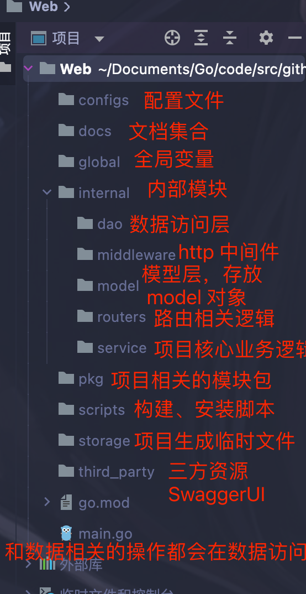

# 一、项目目标

使用 gin 框架查询 K8S 的数据信息
后期新增 K8S 的设置，在界面设置，变更 K8S 的配置

# 二、项目结构

# 三、服务编写流程

## 1、先搭建 gin 基本路由

先创建 gin 基本路由，保障服务启动

## 2、设计数据库表

主要是设计需要的字段信息，根据数据库字段信息，抽取公共字段，和一些特殊字段，这样就可以在 go 里面创建对于的结构体了（数据库字段很重要，后面的结构体，路由参数，文档都需要围绕这些字段）

## 2、设置公共组件

web 应用的基本组件，错误码标准化、配置管理、数据库连接、日志写入、响应处理

### 1、错误码标准化

基本都是固定格式，code 和 msg 有变化，根据前后端定义修改

### 2、日志配置

添加日志后，别忘记路由设置中间件

### 3、配置管理

这时候设置配置文件，也是设置的基本，数据库、启动端口、启动模式

> viper 给嵌套的结构体赋值

### 4、数据库连接设置

固定格式流程

### 5、创建路由和 swagger

要在路由上面写好注解，这样让 wagger 自动生成文档